# SlideKit

A coordinate-based slide layout library built on [Reveal.js](https://revealjs.com), designed for AI agents and humans. You insert arbitrary HTML elements — rich text, images, SVGs, styled divs, anything the browser can render — then position them on a fixed 1920×1080 canvas using explicit coordinates, relative constraints (`below()`, `alignTopWith()`, `between()`), column grids, stacks, and routed connectors. No CSS flexbox, no reflow, no surprises. SlideKit handles text measurement, collision detection, layout validation, and structured linting so you can build polished presentations programmatically.

## Why SlideKit?

AI models are amazing at styling in HTML — they can produce beautiful, polished visual designs. But CSS flow layout is a disaster for fixed-dimension slides. Models struggle to guess how content will reflow, do the math to space elements evenly, avoid overlaps, or align things precisely across columns. They end up debugging cascading layout side-effects instead of designing slides.

SlideKit gives models the styling power of full HTML while replacing CSS flow with a coordinate and constraint-based layout system they can reason about — "align the top edges of these three elements", "place this 24px below that one", "distribute these cards evenly across the safe zone". It uses Reveal.js as its rendering backend and adds declarative constraints on top:

- **You say where things go, and that's where they go.** No layout engine surprises.
- **Constraints express relationships** — `below('title', 24)`, `between('header', 'footer', {axis: 'y'})`, `alignTopWith('sidebar')`. Elements stay connected as you edit.
- **Text is measured in the real DOM** before positioning, so you know exactly how tall a paragraph is.
- **Overlap and boundary violations are detected automatically** — after layout, the full scene graph is available at `window.sk.layouts[N].elements`, and 30+ lint rules check for overlaps, overflow, safe-zone violations, and font-size issues. AI agents can query the scene graph, read lint findings, and fix problems programmatically.
- **Live AI-driven editing** — with a browser MCP (like Playwright), an AI agent can modify slide code, re-render, and watch the results update in the browser in real time — iterating on layout visually without human intervention.

## Live Demos

See SlideKit in action — these are live presentations running in the browser:

- **[What is SlideKit?](https://cabird.github.io/slidekit/examples/slidekit-about/)** — a self-referential deck that teaches SlideKit using SlideKit
- **[Layout Cookbook](https://cabird.github.io/slidekit/examples/layout-cookbook/)** — 60+ layout patterns (cards, grids, panels, connectors, data viz)
- **[Stress Test](https://cabird.github.io/slidekit/examples/stress-test/)** — exercises every feature and edge case
- **[Connector Demo](https://cabird.github.io/slidekit/examples/connector-demo/)** — routed connectors between elements

Press **Ctrl+.** on any demo to toggle the debug inspector.

## Getting Started

### Option 1 — Just grab the bundle (recommended)

You only need three files to start building presentations with an AI:

1. **The SlideKit bundle** (`slidekit.bundle.js`)
2. **The API Quick Reference** (`SLIDEKIT_API_QUICK_REFERENCE.md`) — everything an AI needs to write correct code
3. **The AI Authoring Guide** (`AI_AUTHORING_GUIDE.md`) — workflow, pitfalls, and the render→inspect→correct loop

```bash
curl -O https://raw.githubusercontent.com/cabird/slidekit/main/slidekit/dist/slidekit.bundle.js
curl -O https://raw.githubusercontent.com/cabird/slidekit/main/docs/SLIDEKIT_API_QUICK_REFERENCE.md
curl -O https://raw.githubusercontent.com/cabird/slidekit/main/docs/AI_AUTHORING_GUIDE.md
```

For a more complete reference, also grab:

```bash
curl -O https://raw.githubusercontent.com/cabird/slidekit/main/docs/API.md
curl -O https://raw.githubusercontent.com/cabird/slidekit/main/docs/LAYOUT_COOKBOOK.md
```

To view presentations, serve over HTTP (ES modules require a server — `file://` won't work):

```bash
python -m http.server 8000
# Open http://localhost:8000/your-presentation.html
```

### Option 2 — Clone the repo

```bash
git clone https://github.com/cabird/slidekit.git
cd slidekit
npm install
npm run build          # Bundle → slidekit/dist/slidekit.bundle.js
```

The built bundle is at `slidekit/dist/slidekit.bundle.js`. Copy it into your presentation project, or import directly from the clone.

```bash
npm run typecheck       # TypeScript type checking (tsc --noEmit)
npm run lint            # ESLint (import/no-cycle enforced)
node run-tests.js       # Full test suite (~1032 tests, Playwright browser runner)
```

## Example

```html
<!DOCTYPE html>
<html>
<head>
  <link rel="stylesheet" href="https://cdn.jsdelivr.net/npm/reveal.js@5/dist/reveal.css">
  <link rel="stylesheet" href="https://cdn.jsdelivr.net/npm/reveal.js@5/dist/theme/black.css">
</head>
<body>
  <div class="reveal"><div class="slides"></div></div>
  <script src="https://cdn.jsdelivr.net/npm/reveal.js@5/dist/reveal.js"></script>
  <script type="module">
    import {
      init, render, safeRect,
      el, vstack, connect,
      below, rightOf, between,
    } from './slidekit/dist/slidekit.bundle.js';

    await init();
    const safe = safeRect(); // { x: 120, y: 90, w: 1680, h: 900 }

    await render([{
      background: "#0c0c14",
      elements: [
        el('<h1 style="font:700 64px Inter;color:#fff;margin:0">Hello, SlideKit</h1>', {
          id: "title", x: safe.x, y: safe.y, w: 900,
        }),

        el('<p style="font:400 28px Inter;color:rgba(255,255,255,0.5)">Constraints, connectors, and full HTML</p>', {
          id: "sub", x: safe.x, y: below("title", 16), w: 700,
        }),

        vstack([
          el('<div style="background:#1e293b;border-radius:8px;padding:24px"><p style="font:600 24px Inter;color:#60a5fa;margin:0">Step 1</p><p style="font:400 18px Inter;color:#94a3b8;margin:8px 0 0">Define elements</p></div>', { id: "s1", w: 400 }),
          el('<div style="background:#1e293b;border-radius:8px;padding:24px"><p style="font:600 24px Inter;color:#34d399;margin:0">Step 2</p><p style="font:400 18px Inter;color:#94a3b8;margin:8px 0 0">Add constraints</p></div>', { id: "s2", w: 400 }),
          el('<div style="background:#1e293b;border-radius:8px;padding:24px"><p style="font:600 24px Inter;color:#fbbf24;margin:0">Step 3</p><p style="font:400 18px Inter;color:#94a3b8;margin:8px 0 0">Render & inspect</p></div>', { id: "s3", w: 400 }),
        ], { id: "steps", x: safe.x, y: below("sub", 48), gap: 16 }),

        el('<div style="background:rgba(251,191,36,0.1);border:2px solid #fbbf24;border-radius:12px;padding:32px"><p style="font:700 28px Inter;color:#fbbf24;margin:0 0 12px">Result</p><p style="font:400 20px Inter;color:rgba(255,255,255,0.7);margin:0">Pixel-perfect slides with inspectable layout provenance.</p></div>', {
          id: "result",
          x: rightOf("steps", 80),
          y: between("s1", "s3", { axis: "y" }),
          w: 500, anchor: "cl",
        }),

        connect("steps", "result", {
          id: "arrow", arrow: "end", color: "#fbbf24", thickness: 2,
          fromAnchor: "cr", toAnchor: "cl",
        }),
      ],
    }]);

    Reveal.initialize({ width: 1920, height: 1080, center: false });
  </script>
</body>
</html>
```

> **Important:** `center: false` in `Reveal.initialize` is required — SlideKit handles all positioning.

**Result:**

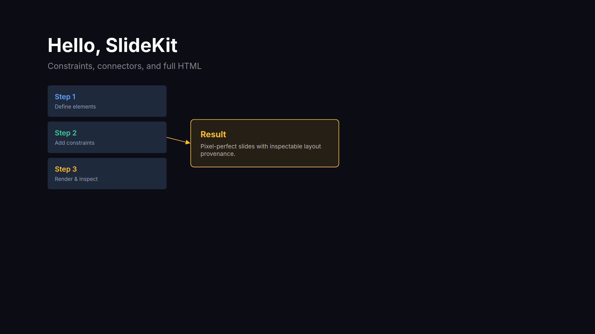

## How It Works

SlideKit uses a multi-phase layout pipeline:

1. **Flatten** — element tree → flat map with parent/child relationships
2. **Intrinsics** — measure text in the DOM, resolve `bounds: 'hug'` containers
3. **Position** — resolve anchors, relative positions (`below()`, `leftOf()`), stacks, `between()`
4. **Finalize** — build scene graph, detect collisions, route connectors, compute z-order

After rendering, `window.sk.layouts[N]` exposes every element's resolved bounds, collisions, and warnings — enabling programmatic validation and AI-driven correction loops.

## Documentation

### Essential (start here)

| Document | Purpose |
|----------|---------|
| [API Quick Reference](docs/SLIDEKIT_API_QUICK_REFERENCE.md) | Complete API in ~10k tokens — all functions, types, rules, and recipes. **Give this to an AI to write slides.** |
| [AI Authoring Guide](docs/AI_AUTHORING_GUIDE.md) | Workflow guide — the render→inspect→correct loop, common pitfalls, debugging strategies |

### Full references

| Document | Purpose |
|----------|---------|
| [API Reference](docs/API.md) | Exhaustive API — every function, parameter, type, edge case, and internal detail |
| [API Compact](docs/API_COMPACT.md) | Condensed API reference (predecessor to Quick Reference, kept for completeness) |
| [Connectors](docs/CONNECTORS.md) | Deep dive on connector routing — types, anchors, port spreading, obstacle avoidance |
| [Layout Cookbook](docs/LAYOUT_COOKBOOK.md) | 47 slide composition patterns with code — hero slides, stat callouts, timelines, diagrams, etc. |
| [Design Reference](docs/SLIDEKIT_DESIGN_REFERENCE.md) | Code-free visual design reference for planning layouts and proposing visual directions |
| [Best Practices](docs/BEST_PRACTICES.md) | Terse, example-driven patterns for common scenarios |

### Other

| Document | Purpose |
|----------|---------|
| [Overview](docs/OVERVIEW.md) | Design philosophy, architecture, pipeline, module structure |
| [Migration Guide](docs/MIGRATION.md) | Upgrading between breaking SlideKit versions |
| [Code Lint Rules](docs/CODE_LINT_RULES.md) | Rules for catching anti-patterns in presentation code |
| [Live Editing](docs/LIVE-EDITING.md) | Live editing via AI + MCP (experimental) |
| [Future Plans](docs/FUTURE_PLANS.md) | Roadmap and planned features |

### For library developers

| Document | Purpose |
|----------|---------|
| [Architecture](docs/for_devs/ARCHITECTURE.md) | Internal architecture, layout pipeline algorithms, data structures |
| [Design Decisions](docs/for_devs/DESIGN_DECISIONS.md) | Key design decisions with rationale |
| [API V2 Design](docs/for_devs/DESIGN_API_V2.md) | API v2 feature design and implementation tracking |
| [Library Changes](docs/for_devs/LIBRARY_CHANGES.md) | Changelog of library-level changes |
| [Linter Improvements](docs/for_devs/LINTER_IMPROVEMENTS.md) | Planned linter enhancements |
| [PPTX Export Strategy](docs/for_devs/PPTX_EXPORT_STRATEGY.md) | Design for PowerPoint export |

## Themes

The companion [slide_themes](https://github.com/cabird/slide_themes) repository has 15 professionally designed presentation themes. Each theme includes:

- **`theme.md`** — a full design specification (colors, typography, spacing, layout patterns, slide recipes)
- **`slides.js`** — a working example deck demonstrating the theme

Give an AI model a theme's `theme.md` and `slides.js` along with the SlideKit docs, and it can generate a complete slide deck matching that aesthetic. You can also mix and match — "use the colors from `cobalt-serif-editorial` with the layout and typography of `bold-pitch-modern`" — and the model can synthesize a coherent result because each theme is fully specified in plain text.

## Examples

See the [`examples/`](examples/) directory:

- **slidekit-about** — a presentation about SlideKit itself, exercising most API features ([PDF](examples/slidekit-about/slidekit-about.pdf))
- **stress-test** — 18-slide deck that exercises every layout primitive and edge case ([PDF](examples/stress-test/stress-test.pdf))
- **connector-demo** — connector types, routing, and styling ([PDF](examples/connector-demo/connector-demo.pdf))
- **layout-cookbook** — rendered examples from the Layout Cookbook doc ([PDF](examples/layout-cookbook/layout-cookbook.pdf))

## Project Structure

```
slidekit/
  slidekit.ts          # Barrel file — re-exports public API from src/
  src/                 # TypeScript source (~33 modules)
  dist/                # Built bundles (slidekit.bundle.js, slidekit.bundle.min.js)
  test/                # Browser-based tests (mocha/chai via Playwright, ~1027 tests)
  examples/            # Runnable example slide files
docs/                  # All documentation
build.js               # esbuild config (injects version)
run-tests.js           # Test runner (launches Playwright)
```

## Gallery

The [slidekit-about](examples/slidekit-about/) example is a presentation that explains how SlideKit works — and it was itself built entirely with SlideKit:

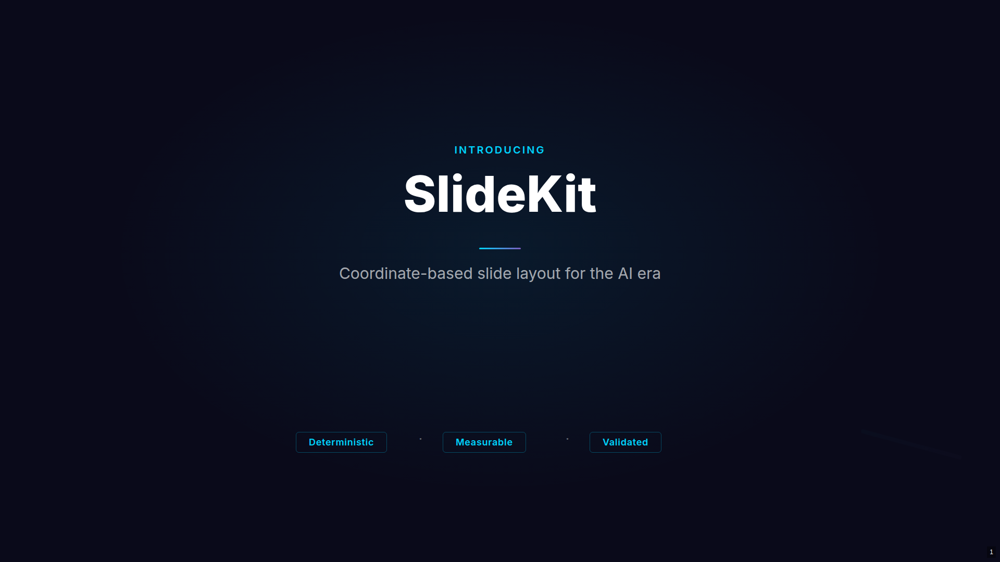
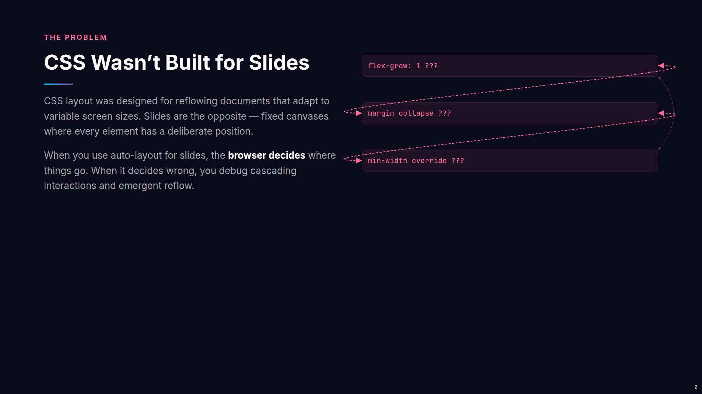
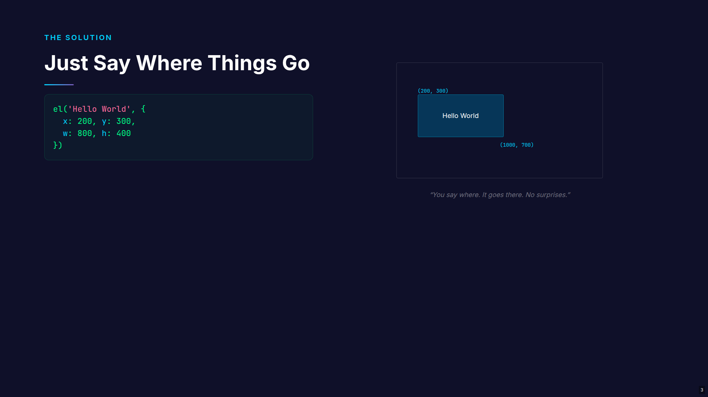
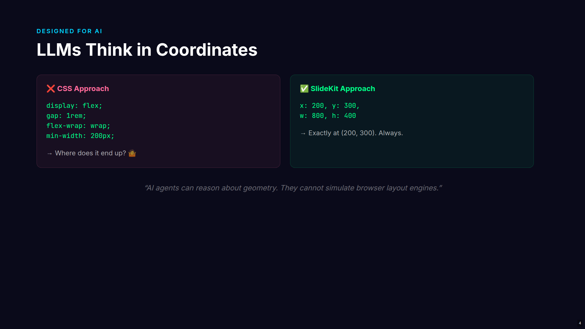
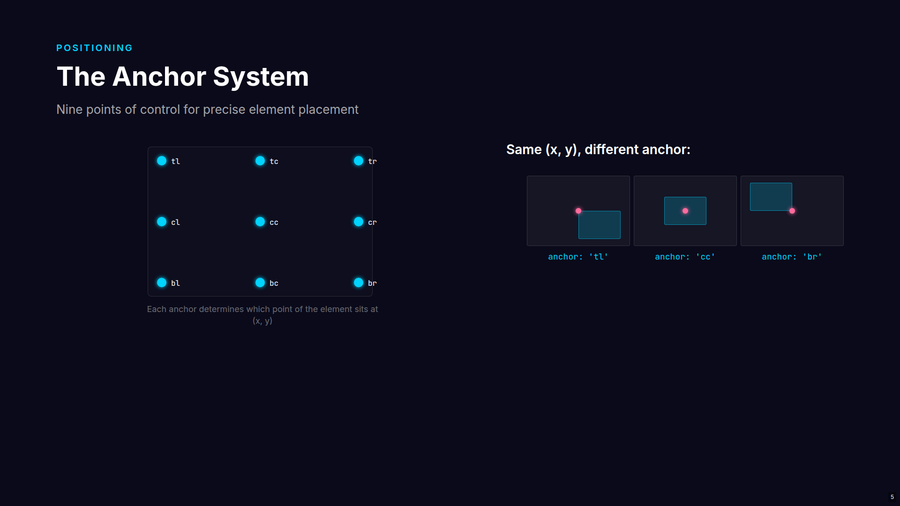
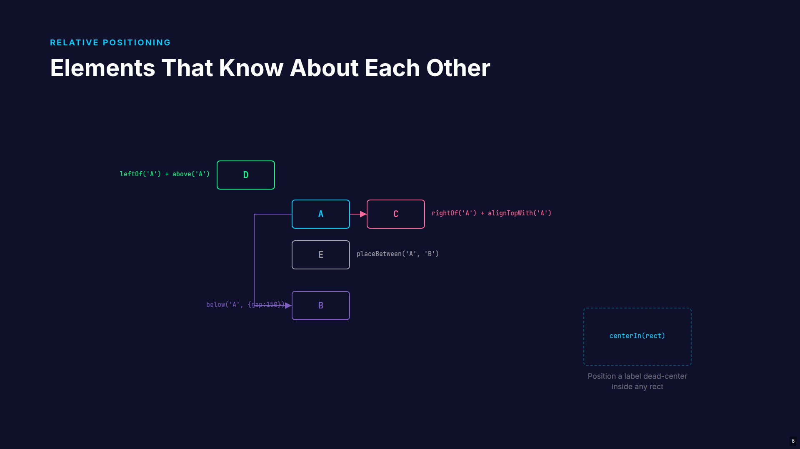
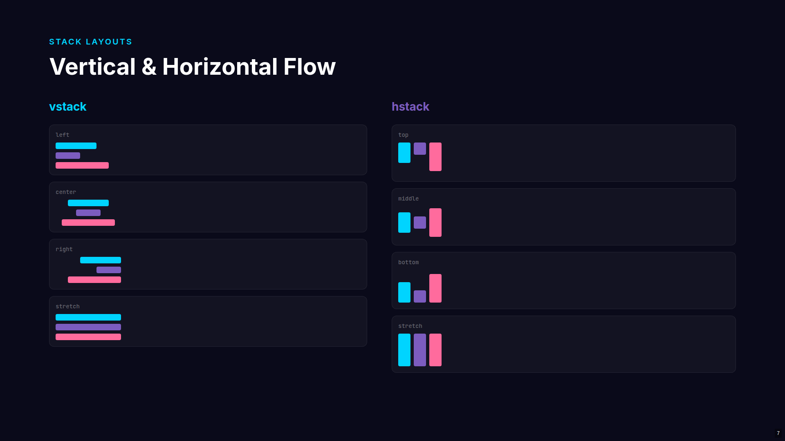
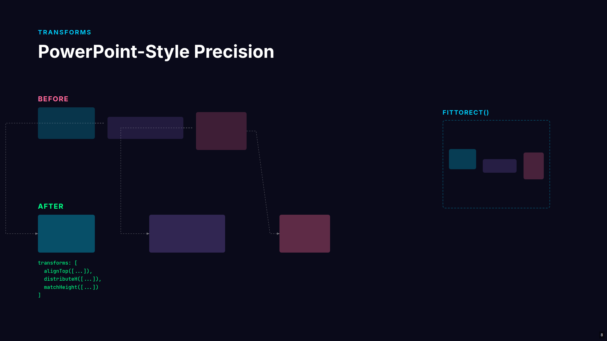
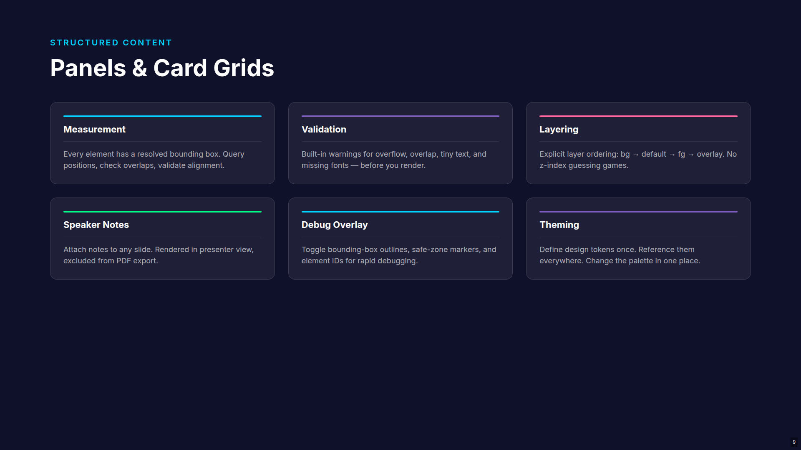
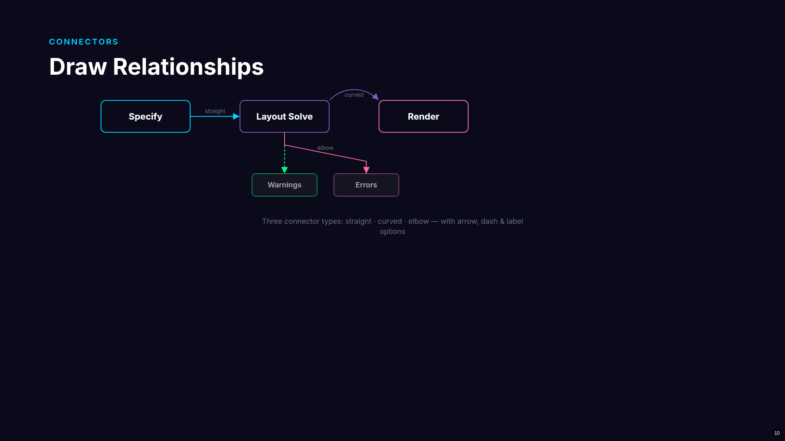
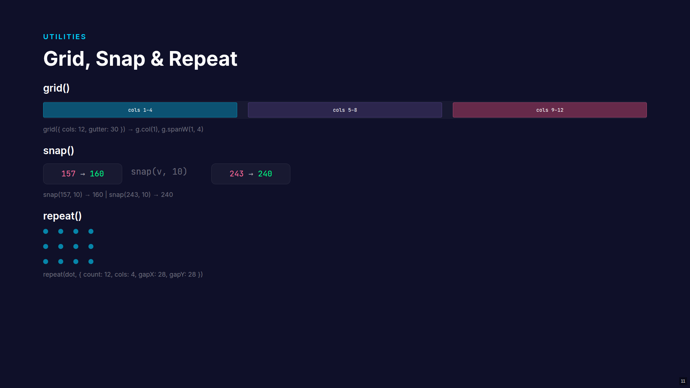
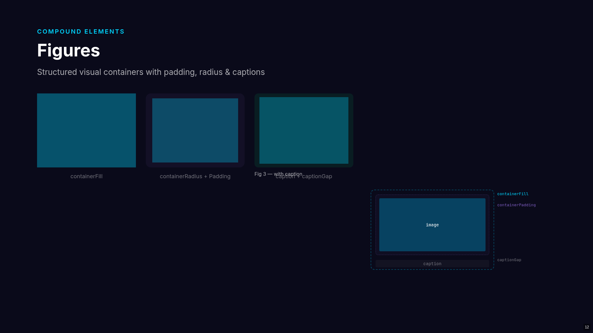
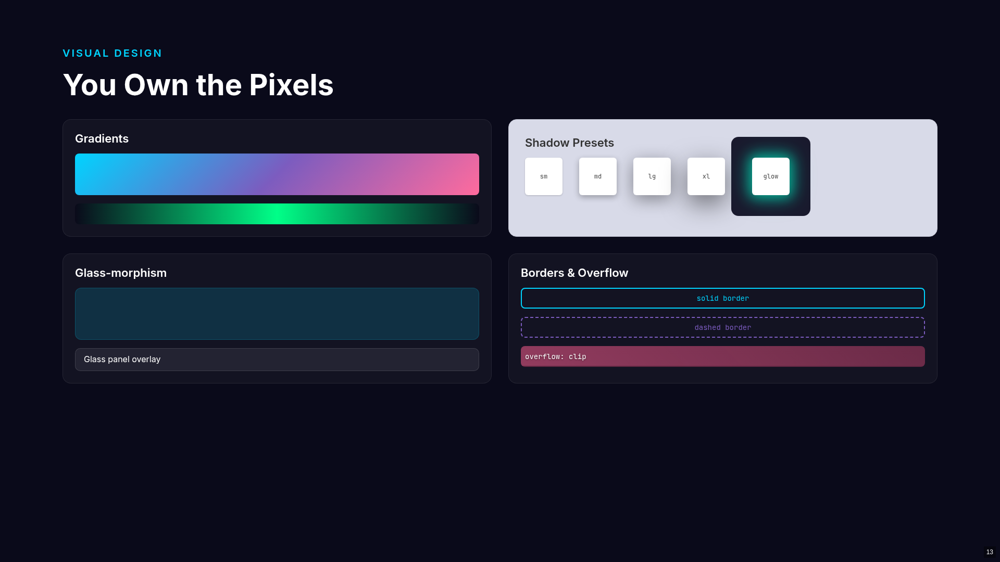
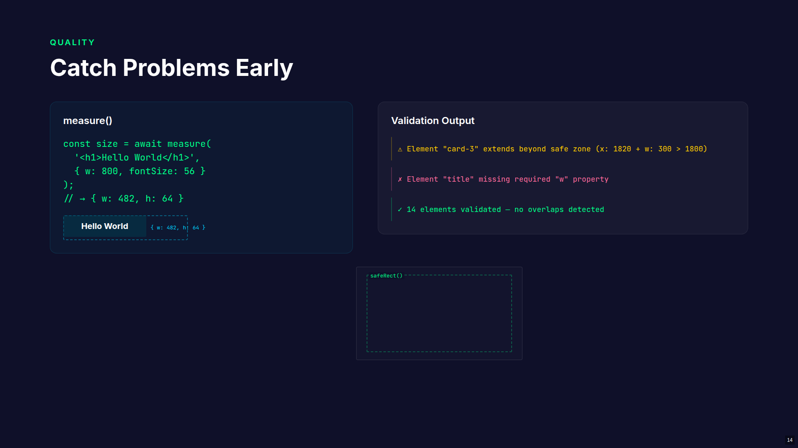
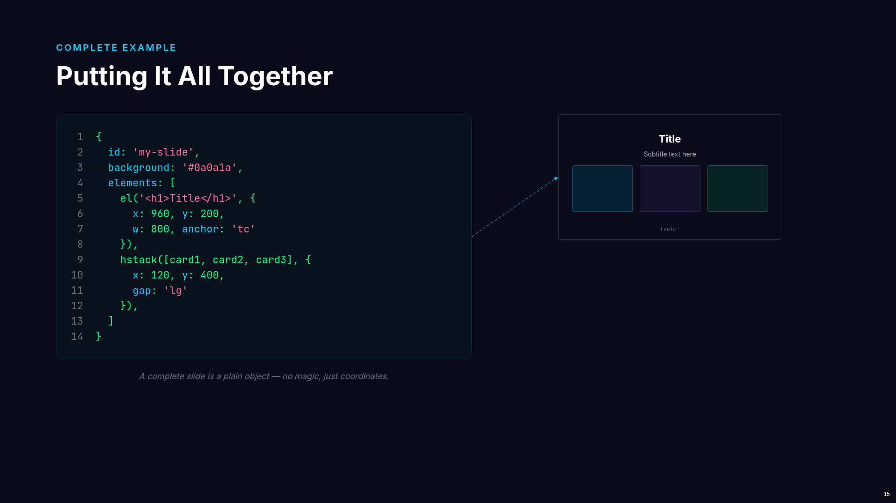
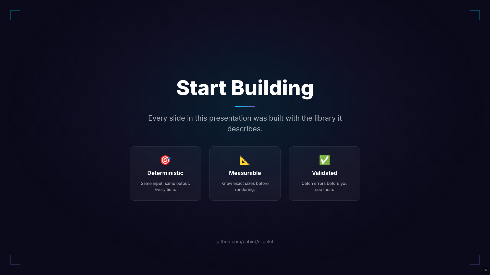

## License

MIT — see [LICENSE](LICENSE) for details.
