# SlideKit Architecture

> **Current as of:** `66ce7bc` (2026-03-02)

This document explains how SlideKit works at the implementation level. It is written for developers who want to understand, debug, or extend the codebase. It goes beyond the API surface described in [API.md](API.md) and the conceptual model in [OVERVIEW.md](OVERVIEW.md) to explain the actual code paths, data structures, and design decisions.

---

## High-Level Overview

SlideKit is a coordinate-based layout library for building presentation slides on a fixed 1920x1080 canvas. Instead of CSS auto-layout, you specify exact positions and sizes for every element, and SlideKit handles measurement, dependency resolution, collision detection, validation, and DOM rendering into Reveal.js sections.

The core insight: slides are fixed-dimension canvases where every element has a deliberate position. SlideKit replaces the unpredictability of CSS layout with explicit coordinate geometry that is easy for both humans and LLM agents to reason about.

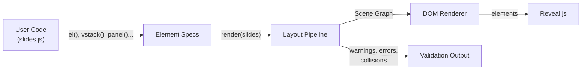

---

## Source Organization

The library lives in `src/` as 18 TypeScript modules plus a 6-module layout pipeline. The top-level `slidekit.ts` is a barrel file that re-exports the public API (and a `SlideKit` default namespace object for convenient `SlideKit.*` usage). Users always import from the barrel; `src/` modules import from each other.

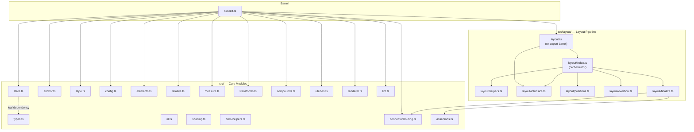

### Module Responsibilities

| Module | Role | Key Exports |
|--------|------|-------------|
| `state.ts` | Single mutable state object (config, caches, counters). Leaf dependency -- imports nothing from the project. | `state` |
| `types.ts` | TypeScript type definitions (`interface`, `type`). No runtime code. | Type aliases |
| `id.ts` | Auto-incrementing element ID generator (`sk-1`, `sk-2`, ...). Reset at start of each `layout()`/`render()` call. | `nextId()`, `resetIdCounter()` |
| `anchor.ts` | 9-point anchor grid resolution. Converts `(x, y, w, h, anchor)` to CSS `{left, top}`. | `resolveAnchor()`, `VALID_ANCHORS` |
| `spacing.ts` | Semantic spacing tokens (`xs`..`section`). Resolves token strings to pixel values. | `resolveSpacing()`, `getSpacing()`, `DEFAULT_SPACING` |
| `style.ts` | CSS property filtering (blocked layout props), baseline CSS generation, shadow presets. | `filterStyle()`, `_baselineCSS()`, `resolveShadow()` |
| `config.ts` | `init()`, safe zone computation, font loading, `safeRect()`, `splitRect()`, `_resetForTests()`. | `init()`, `safeRect()`, `splitRect()`, `getConfig()` |
| `dom-helpers.ts` | Single utility: `applyStyleToDOM()` for applying camelCase CSS to DOM elements. | `applyStyleToDOM()` |
| `elements.ts` | Core element constructors with default merging. | `el()`, `group()`, `vstack()`, `hstack()`, `cardGrid()` |
| `relative.ts` | Relative positioning helpers that produce `_rel` marker objects. | `below()`, `rightOf()`, `centerIn()`, `placeBetween()`, etc. |
| `measure.ts` | Off-screen DOM measurement with caching. Creates a hidden container with baseline CSS. | `measure()`, `clearMeasureCache()` |
| `transforms.ts` | PowerPoint-style alignment, distribution, and size-matching transforms. Both factory functions and the `applyTransform()` executor. | `alignTop()`, `distributeH()`, `matchWidth()`, `fitToRect()`, etc. |
| `compounds.ts` | Higher-level primitives built on `el()`, `group()`, and `vstack()`. | `connect()`, `panel()`, `figure()`, `getAnchorPoint()` |
| `utilities.ts` | Grid system, snap, percentage resolution, repeat/duplicate, rotated AABB. | `grid()`, `snap()`, `resolvePercentage()`, `repeat()`, `rotatedAABB()` |
| `renderer.ts` | DOM rendering, z-order computation, SVG connector building, Reveal.js integration, post-render overflow detection. | `render()`, `renderElementFromScene()`, `computeZOrder()` |
| `connectorRouting.ts` | Orthogonal polyline routing for connectors with obstacle avoidance. | `routeConnector()` |
| `lint.ts` | Static analysis rules for scene graphs (font sizes, spacing, alignment, density, etc.). | `lintSlide()`, `lintDeck()` |
| `assertions.ts` | Runtime assertion helpers for null/Map-miss checks. | `assertDefined()`, `mustGet()`, `assertUnreachable()` |
| `layout.ts` | Re-export barrel forwarding from `layout/index.ts` and `layout/intrinsics.ts`. | `layout()`, `getEffectiveDimensions()` |

### Dependency Rules

1. **No circular imports.** Enforced by ESLint `import/no-cycle` at lint time.
2. **state.ts is a leaf.** It imports only `types.ts` for type annotations -- no runtime dependencies.
3. **Renderer/Layout decoupling.** The renderer needs `layout()` but importing it directly would create a cycle. The barrel file resolves this by calling `_setLayoutFn(layout)` at initialization, injecting the dependency.
4. **Fan-in to the barrel.** `slidekit.ts` imports from all `src/` modules; `src/` modules import from each other but never from the barrel.

---

## Component Model

### Element Creation

All elements are plain JavaScript objects. There are no classes, no prototypes, no `this`. The constructors are factory functions that return `{ id, type, content?, children?, props }`.

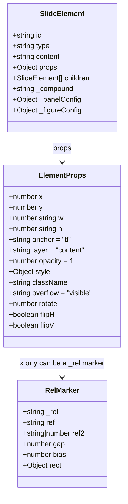

### Primitive Types

| Type | Constructor | Structure | Purpose |
|------|------------|-----------|---------|
| `el` | `el(html, props)` | `{ id, type:"el", content, props }` | Positioned HTML element. The single content primitive. |
| `group` | `group(children, props)` | `{ id, type:"group", children, props }` | Container with shared coordinate origin. |
| `vstack` | `vstack(items, props)` | `{ id, type:"vstack", children, props }` | Vertical stack with `gap` and `align`. |
| `hstack` | `hstack(items, props)` | `{ id, type:"hstack", children, props }` | Horizontal stack with `gap` and `align`. |
| `connector` | `connect(fromId, toId, props)` | `{ id, type:"connector", props }` | SVG line/arrow between two elements. |

### Compound Primitives

Compound primitives are syntactic sugar that compose the basic types:

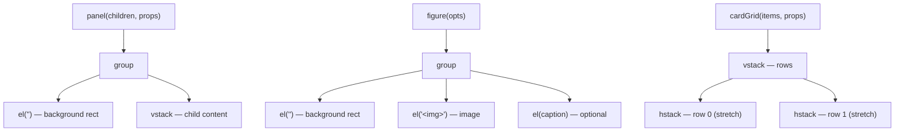

**Panel internals:** `panel()` creates a `group` tagged with `_compound: "panel"` and `_panelConfig: { padding, gap, panelW, panelH }`. The layout pipeline uses these tags to compute auto-height and emit overflow warnings. Children using `w: "fill"` are resolved at panel creation time to `panelW - 2 * padding`.

**Figure internals:** `figure()` creates a `group` tagged with `_compound: "figure"` and `_figureConfig`. The image element is inset by `containerPadding`, and an optional caption is positioned below the container at `y: h + captionGap`.

### Default Merging

`applyDefaults(props, extraDefaults)` in `elements.ts` merges user props with `COMMON_DEFAULTS`:

```js
COMMON_DEFAULTS = {
  x: 0, y: 0, anchor: "tl", layer: "content",
  opacity: 1, style: null, className: "", vAlign: "top"
}
```

The `style` property always gets a fresh `{}` per element to prevent shared-reference mutation bugs. The `id` property lives on the element object itself, not in `props`.

---

## Runtime Pipeline

### What Happens When You Call `render()`

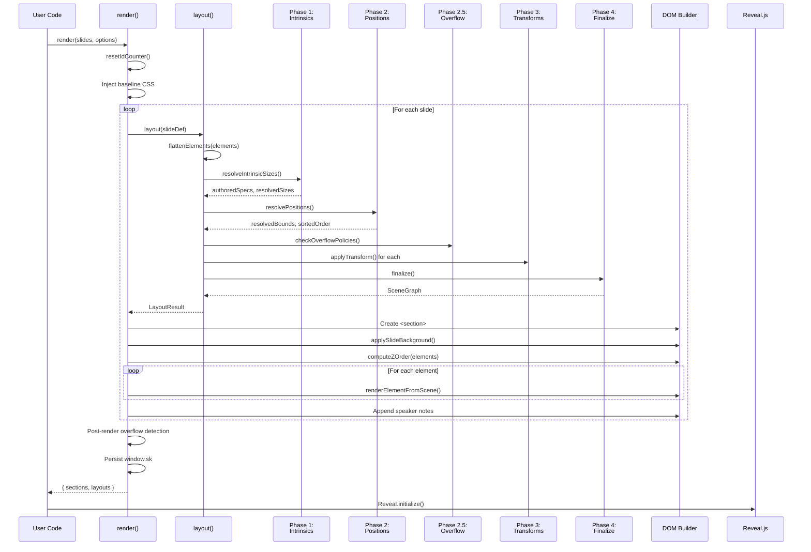

### What Happens When You Call `layout()` Directly

The same pipeline runs, minus the DOM rendering. This is useful for inspecting the scene graph, checking warnings, and validating layouts without rendering.

---

## Layout Engine

### Phase 1: Intrinsic Size Resolution

**File:** `src/layout/intrinsics.ts` -- `resolveIntrinsicSizes()`

Phase 1 determines how big every element is before knowing where it goes. This phase runs asynchronously because it may call `measure()` for DOM-based text measurement.

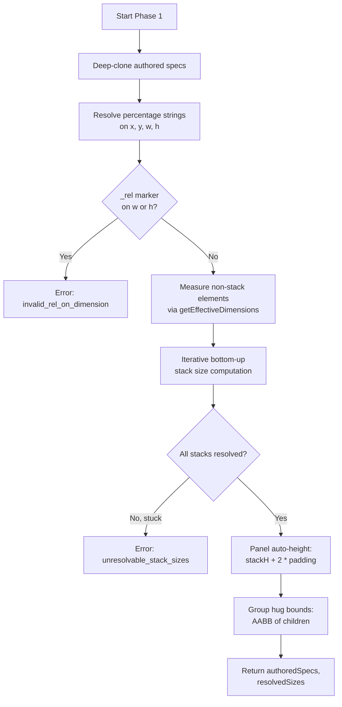

**Key details:**

- **`getEffectiveDimensions(element)`**: For `el()` without explicit `h`, calls `measure(html, props)` to get the rendered height. Returns `{ w, h, _autoHeight: boolean }`.
- **Stack size computation**: Iterative bottom-up. A stack can only be sized once all its children have known sizes. The loop processes stacks whose children are fully resolved, then repeats until all stacks are done. Nested stacks resolve naturally: inner stacks resolve first, then outer stacks.
- **Panel auto-height**: For panel compounds without explicit `h`, the panel height is computed as `innerVstackHeight + 2 * padding`. The background rect height is updated to match.
- **Hug bounds**: Groups with `bounds: "hug"` compute their `w`/`h` from the axis-aligned bounding box of their children (only children with resolved numeric positions; `_rel` markers are skipped).
- **Percentage resolution**: Strings like `"50%"` and `"safe:25%"` are resolved to pixel values using `resolvePercentage()`. This runs before validation, so downstream phases always see numbers.

**Output data structures:**

- `authoredSpecs: Map<id, { type, content, props, children }>` -- deep clones of the original element specs, preserved for provenance tracking.
- `resolvedSizes: Map<id, { w, h, wMeasured, hMeasured }>` -- the computed width and height for every element.

### Phase 2: Position Resolution

**File:** `src/layout/positions.ts` -- `resolvePositions()`

Phase 2 determines where every element goes. It builds a dependency graph from `_rel` markers and uses Kahn's algorithm (BFS topological sort) to resolve positions in dependency order.

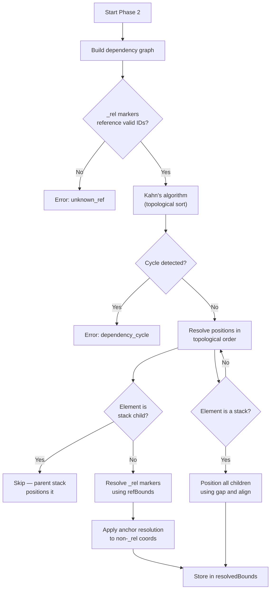

**Dependency graph construction:**

- Each element maps to a set of element IDs it depends on.
- Stack children depend on their parent stack (not on their own `_rel` markers, which are ignored with a warning).
- `_rel` markers on `x` and `y` produce edges to the referenced element.
- `placeBetween` markers with `ref2` as a string ID add a second dependency.
- Connectors depend on both `fromId` and `toId`.

**Position resolution for non-stack-children:**

1. Resolve `x`: If `_rel` marker, call `resolveRelMarker()` with the referenced element's resolved bounds. Special handling for `centerIn` (uses rect, not element ref) and `between` (interpolates between two references using bias).
2. Resolve `y`: Same logic.
3. Apply anchor: For authored (non-`_rel`) coordinates only, call `resolveAnchor(x, y, w, h, anchor)` to convert the user-specified anchor point to a CSS `{left, top}` position.

**Stack child positioning:**

When the topological sort reaches a stack, all its children are positioned immediately:

- **vstack**: Children stacked top-to-bottom. `curY` starts at the stack's Y position and increments by `childH + gap`. Horizontal alignment (`left`/`center`/`right`/`stretch`) controls each child's X.
- **hstack**: Children placed left-to-right. `curX` starts at the stack's X position and increments by `childW + gap`. Vertical alignment (`top`/`middle`/`bottom`/`stretch`) controls each child's Y.
- **stretch**: All children get the same cross-axis dimension (the max among them, or the stack's authored dimension). Auto-height `el()` children are re-measured at the new width via `measure()`.

**Output:** `resolvedBounds: Map<id, { x, y, w, h }>` -- the final top-left position and dimensions for every element.

### Phase 2.5: Overflow Policies

**File:** `src/layout/overflow.ts` -- `checkOverflowPolicies()`

For `el()` elements with an explicit `h` and a non-`"visible"` overflow policy, this phase re-measures the content and checks if it overflows:

| Overflow Policy | Behavior |
|----------------|----------|
| `"visible"` (default) | No check, no clipping |
| `"clip"` | Sets `_layoutFlags.clip = true` (renderer applies `overflow: hidden`) |
| `"warn"` | Emits a `content_overflow` warning |
| `"error"` | Emits a `content_overflow` error |

### Phase 3: Transforms

**File:** `src/layout/index.ts` (orchestrator) + `src/transforms.ts` (`applyTransform()`)

Transforms are PowerPoint-style batch operations declared in the slide's `transforms` array. They run after position resolution and modify `resolvedBounds` in place.

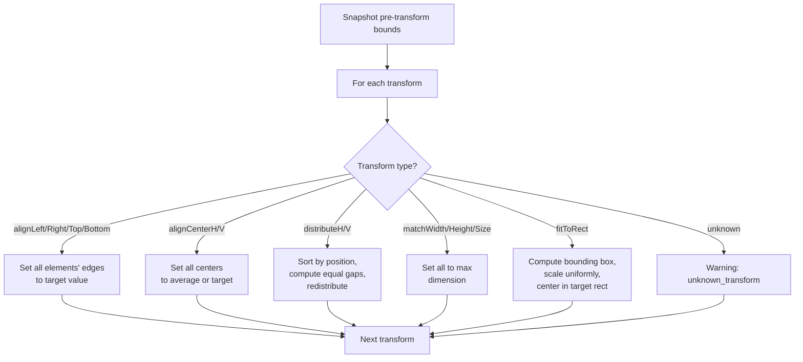

Transforms are created by factory functions (`alignTop()`, `distributeH()`, etc.) that return `{ _transform, _transformId, ids, options }` marker objects. The `_transformId` is auto-generated for deterministic ordering. `applyTransform()` validates element IDs, warns about missing ones, then mutates `resolvedBounds` directly.

After all transforms run, the orchestrator compares pre-transform and post-transform bounds per-axis to build accurate provenance (only marking axes that actually changed as `source: "transform"`).

### Phase 4: Finalize

**File:** `src/layout/finalize.ts` -- `finalize()`

Phase 4 assembles the hierarchical scene graph, resolves connector endpoints, runs collision detection, and performs presentation-specific validations.

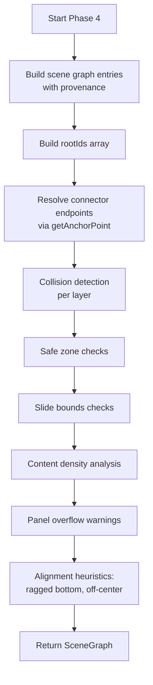

---

## Key Data Structures

### The Flat Map

Before layout begins, `flattenElements()` in `helpers.ts` walks the element tree recursively and produces:

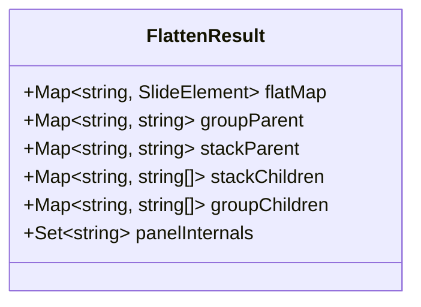

- **`flatMap`**: Every element by ID, including nested children. Used for O(1) lookup throughout the pipeline.
- **`groupParent`**: Maps child ID to parent group ID. Used for coordinate offset calculations and ancestry checks.
- **`stackParent`**: Maps child ID to parent stack ID. Stack children get their positions from the stack's layout algorithm, not from their own `x`/`y` props.
- **`stackChildren`**: Maps stack ID to ordered array of child IDs. Preserves declaration order for layout.
- **`groupChildren`**: Maps group ID to ordered array of child IDs.
- **`panelInternals`**: Set of IDs for synthetic panel elements (background rect and inner vstack). Marked as `_internal: true` in the scene graph.

### The Scene Graph (LayoutResult)

The layout pipeline returns this structure:

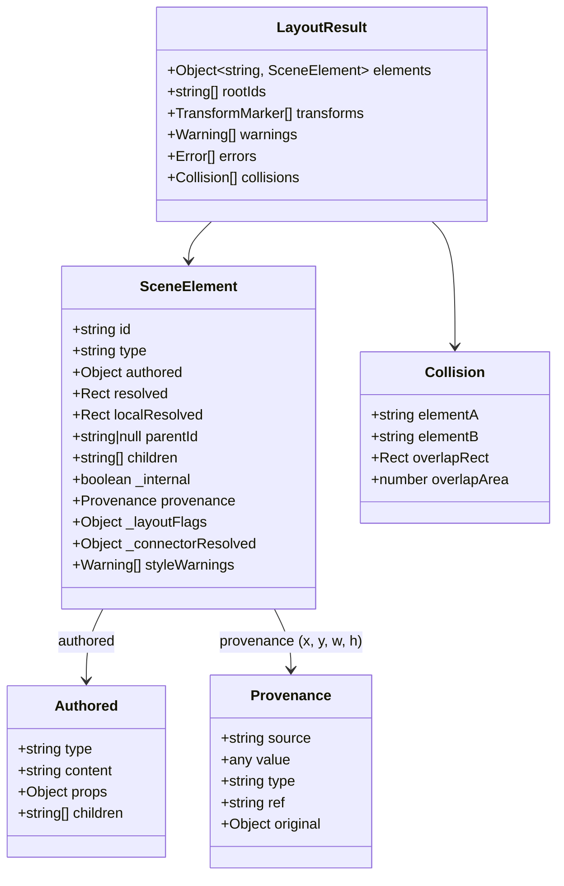

**Provenance sources:**

| Source | Meaning |
|--------|---------|
| `"authored"` | Value came directly from user-specified props. Contains `value`. |
| `"measured"` | Value was computed by `measure()`. Contains `measuredAt: { w, className }`. |
| `"constraint"` | Value was resolved from a `_rel` marker. Contains `type`, `ref`, `gap`, `bias`, etc. |
| `"stack"` | Value was set by a parent vstack/hstack. Contains `stackId`. |
| `"transform"` | Value was modified by a Phase 3 transform. Contains `original` (the pre-transform provenance). |
| `"default"` | Value was not specified by the user and fell through to a pipeline default. |

**`localResolved` vs `resolved`:**

- Root elements: `localResolved === resolved`.
- Group children: `localResolved === resolved` (group children's coords are already group-relative).
- Stack children: `localResolved = { x: resolved.x - stackX, y: resolved.y - stackY, w, h }`.

### The `window.sk` Runtime Object

After `render()`, the scene model persists on `window.sk`:

```js
window.sk = {
  layouts: [LayoutResult, ...],          // one per slide
  slides: [{ id, layout }, ...],         // parallel array with slide IDs
  _config: { slide, safeZone, ... },     // deep copy of config
};
```

This enables console-based inspection and live editing workflows.

---

## Measurement System

**File:** `src/measure.ts`

Measurement is how SlideKit determines the rendered dimensions of HTML content. It is the bridge between the specification world (user code) and the physical world (browser rendering).

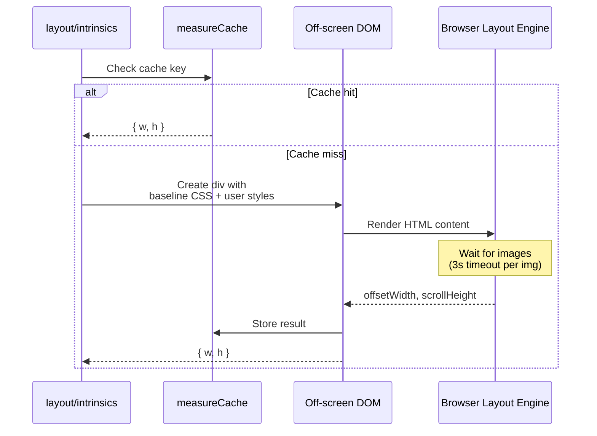

**How it works:**

1. **Container creation** (`_ensureMeasureContainer()`): A hidden `<div>` is created once and positioned at `(-9999px, -9999px)` with `visibility: hidden`. A `<style>` tag inside it applies the baseline CSS using the `[data-sk-measure]` selector.

2. **Measurement** (`measure(html, props)`):
   - Creates a temporary `<div>` inside the container.
   - Sets constraining width if `props.w` is provided.
   - Applies filtered user styles and className.
   - Sets `data-sk-measure` attribute to trigger the baseline CSS reset.
   - Injects `html` via `innerHTML`.
   - Waits for any `` elements to load (with 3-second timeout).
   - Reads `offsetWidth` and `scrollHeight`.
   - Removes the div and caches the result.

3. **Cache key**: `JSON.stringify(["el", html, w, sortedStyleJSON, className])`. Identical calls return cached values instantly.

4. **Parity guarantee**: The baseline CSS applied during measurement is identical to the baseline CSS applied during rendering (both generated by `_baselineCSS(prefix)` with different selector prefixes). This eliminates "split brain" where text measures one size but renders another.

---

## Rendering

**File:** `src/renderer.ts`

### Z-Order Computation

`computeZOrder(elements)` sorts elements into render order:

1. **Layer**: `bg` (0) < `content` (1) < `overlay` (2)
2. **Explicit `z` value**: Default 0, higher renders on top
3. **Declaration order**: Tiebreaker for same layer and z

Returns a `Map<id, zIndex>` where values are consecutive integers starting from 1.

### Element Rendering

`renderElementFromScene(element, zIndex, sceneElements, offsetX, offsetY)` creates DOM elements from the scene graph:

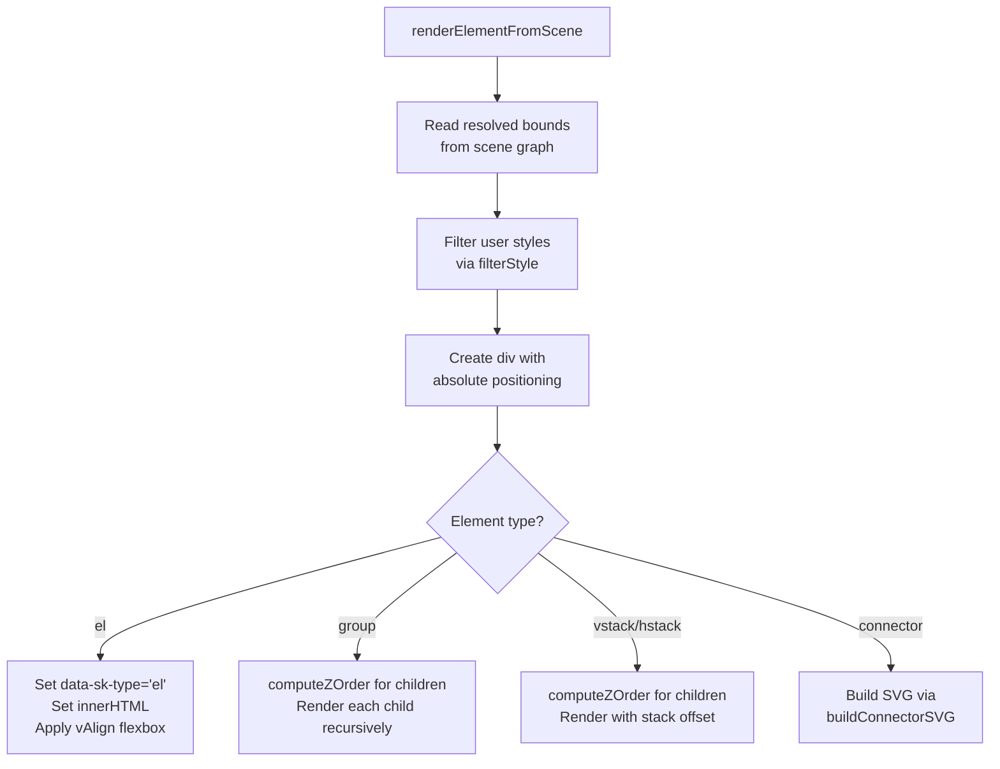

**Stack rendering detail:** Stack children have absolute (slide-level) coordinates in the scene graph, but they are nested in the stack's DOM div. The stack's position is passed as `offsetX`/`offsetY` to subtract from each child's coordinates, converting them to stack-relative positions for CSS `left`/`top`.

### Connector SVG

`buildConnectorSVG(from, to, connProps)` creates an SVG element inside a positioned wrapper div:

| Connector Type | Path |
|----------------|------|
| `"straight"` | SVG `<line>` between points |
| `"curved"` | Cubic bezier (`C` path) with 40% offset along dominant axis |
| `"elbow"` | Right-angle path: horizontal -> vertical -> horizontal |

Arrow markers are created as SVG `<marker>` elements with unique IDs per connector (to avoid cross-connector collisions in some browsers).

### Reveal.js Integration

`applySlideBackground(section, background)` routes background values:

| Input Pattern | Reveal Attribute |
|--------------|-----------------|
| `#hex`, `rgb()`, `hsl()` | `data-background-color` |
| `linear-gradient(...)`, `radial-gradient(...)` | `data-background-gradient` |
| Everything else (image paths/URLs) | `data-background-image` |

### Post-Render Overflow Detection

After all slides are rendered to DOM, `render()` checks every `el`-type element:

- If `scrollHeight > clientHeight + 1px` -> `dom_overflow_y` warning
- If `scrollWidth > clientWidth + 1px` -> `dom_overflow_x` warning

The 1px tolerance avoids sub-pixel false positives. These warnings catch divergences between off-screen `measure()` and actual browser layout.

---

## Validation and Warnings

The validation system produces structured JSON objects, not console messages. Every warning and error has a `type`, `elementId`, and descriptive `message`.

### Validation Checks in the Pipeline

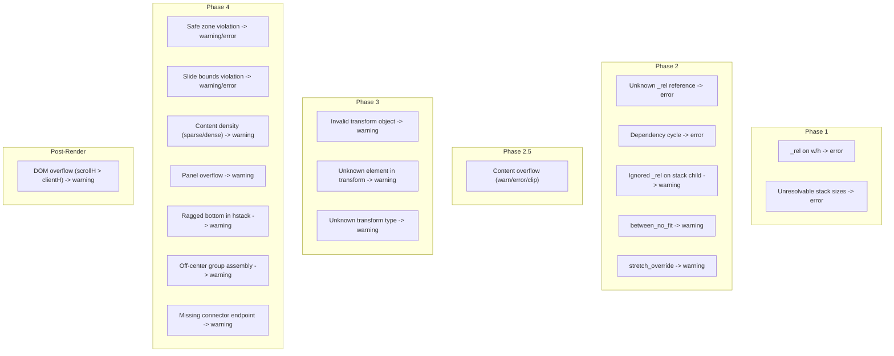

### Strict Mode

When `init({ strict: true })`:
- Safe zone violations become errors instead of warnings
- Slide bounds violations become errors instead of warnings

### Layer-Aware Suppression

Elements on `layer: "bg"` are exempt from safe zone checks. Full-bleed backgrounds are expected to extend beyond the safe zone. Group children and stack children are also exempt (they inherit their container's positioning context).

### Collision Detection

Collision detection runs per-layer during Phase 4:

1. **Element selection**: Skip group children (group-relative coords), skip stack containers (their children are the real elements), skip zero-sized elements.
2. **Ancestry check**: Skip pairs where one element is an ancestor of the other (walks the full group/stack parent chain).
3. **Absolute bounds**: Elements inside groups have their bounds adjusted by walking up the group parent chain.
4. **Rotation**: For rotated elements, the AABB of the rotated rectangle is computed using `rotatedAABB()` and used for collision testing.
5. **AABB intersection**: `computeAABBIntersection()` returns the overlap rectangle if any.
6. **Threshold**: Only overlaps exceeding `collisionThreshold` (px^2) are reported.

### Content Density Analysis

Phase 4 computes the bounding box of all content-layer elements and compares its area to the safe zone area:

- Usage < 40%: `content_clustered` warning ("content may be too clustered")
- Usage > 95%: `content_no_breathing_room` warning

### Alignment Heuristics

Two heuristic checks in Phase 4:

1. **Ragged bottom**: For hstacks without `align: "stretch"`, if children have height differences > 5px, a `ragged_bottom` warning suggests using stretch.
2. **Off-center assembly**: For groups with a center anchor and explicit width, if the content bounding box width differs from the authored width by > 20px, an `off_center_assembly` warning suggests using `bounds: "hug"`.

---

## Centralized State

**File:** `src/state.ts`

All mutable state lives in a single exported object:

```js
export const state = {
  idCounter: 0,               // Auto-ID counter (sk-1, sk-2, ...)
  config: null,                // Active SlideKitConfig from init()
  safeRectCache: null,         // Cached safe zone rectangle
  loadedFonts: new Set(),      // "FontFamily:weight" strings
  measureContainer: null,      // Off-screen DOM element for measure()
  measureCache: new Map(),     // (cacheKey) -> { w, h }
  fontWarnings: [],            // Font loading failure warnings
  injectedFontLinks: new Set(),// <link> elements in document.head
  transformIdCounter: 0,       // Auto-ID for transforms
};
```

Modules import `state` and read/write its properties directly. There is no event system, no reactivity, no pub/sub. State is mutated imperatively during `init()`, `measure()`, and `layout()`.

`_resetForTests()` wipes everything: config, caches, counters, DOM elements, and injected font links.

---

## CSS Filtering and Baseline

### Blocked Properties

`filterStyle()` in `style.ts` normalizes CSS property names to camelCase and checks them against a blocklist. Blocked categories:

- **Layout positioning**: `position`, `top`, `left`, etc. (SlideKit owns absolute positioning)
- **Sizing**: `width`, `height`, `minWidth`, etc. (SlideKit owns via `w`/`h` props)
- **Display**: `display` (SlideKit needs block/flex control)
- **Overflow**: `overflow`, `overflowX`, `overflowY` (SlideKit manages via `overflow` prop)
- **Margin**: All margin properties (breaks absolute positioning)
- **Transform**: `transform`, `translate`, `rotate`, `scale` (SlideKit owns via `rotate`, `flipH`, `flipV` props)
- **Containment**: `contain`, `contentVisibility` (can suppress layout/paint)

Vendor-prefixed variants (e.g., `WebkitTransform`) are also caught by `stripVendorPrefix()`.

Each blocked property has a prescriptive suggestion message explaining the alternative.

### Baseline CSS

`_baselineCSS(prefix)` generates a stylesheet that:

1. Neutralizes inherited host-framework styles (Reveal.js headings, margins, etc.)
2. Establishes predictable defaults (`text-align: left`, `line-height: 1.2`, `margin: 0`)
3. Prevents framework responsive rules from affecting media elements (`max-width: none`)

The same CSS is applied in both contexts:
- **Measurement**: `[data-sk-measure]` selector, injected into the measure container
- **Rendering**: `[data-sk-type="el"]` selector, injected into the Reveal.js container

This parity is what ensures `measure()` and `render()` agree on dimensions.

### CSS Specificity Strategy

SlideKit uses a **triple-attribute-selector** strategy (`[data-sk-type="el"]×3`) to override Reveal.js styles with high specificity. This is by design — Reveal.js applies aggressive default styles to headings, paragraphs, images, and other elements. Rather than fighting these with inline style overrides on individual elements, all Reveal CSS resets belong in `_baselineCSS()` in `style.ts`. If an element has unexpected margins, padding, or font sizes, the fix goes in `_baselineCSS()`, not in individual slide code.

---

## Extension Points

### Spacing Tokens

The default scale (`xs: 8, sm: 16, md: 24, lg: 32, xl: 48, section: 80`) can be extended or overridden via `init({ spacing: { hero: 120 } })`. Custom tokens merge with defaults.

`resolveSpacing(value)` handles resolution: numbers pass through, strings are looked up in the active scale (or `DEFAULT_SPACING` if `init()` hasn't been called).

### Grid System

`grid({ cols, gutter, margin })` creates a column grid for consistent cross-slide positioning. It returns `col(n)` and `spanW(from, to)` functions. The grid computes its total width from the safe zone margins (or custom margins) and distributes columns with gutters.

### Repeat / Duplicate

`repeat(element, { count, cols, gapX, gapY, startX, startY })` deep-clones an element `count` times, laying copies out in a row-major grid. Each copy gets a suffixed ID (`{baseId}-1`, `{baseId}-2`, etc.), and nested children are recursively re-IDed.

### Percentage Sugar

`resolvePercentage(value, axis)` resolves `"N%"` to slide-relative pixels and `"safe:N%"` to safe-zone-relative pixels. This is called during Phase 1 before any other processing.

### `splitRect()`

Splits a rectangle into left and right sub-rectangles with configurable `ratio` and `gap`. Commonly used with `safeRect()` for split-layout slides (text + image).

---

## Type Safety

All source files are TypeScript (`.ts`). Type definitions are centralized in `src/types.ts` as `interface` and `type` declarations. Running `tsc --noEmit` validates types across all modules.

Key type definitions:

| Type | Description |
|------|-------------|
| `SlideElement` | Element with `id`, `type`, `content`, `props`, `children`, compound tags |
| `SceneElement` | Resolved element in the scene graph with `authored`, `resolved`, `localResolved`, `provenance` |
| `LayoutResult` | Full pipeline output: `elements`, `rootIds`, `transforms`, `warnings`, `errors`, `collisions` |
| `RelMarker` | Deferred positioning marker: `{ _rel, ref, gap, ... }` |
| `TransformMarker` | Transform operation: `{ _transform, _transformId, ids, options }` |
| `FlattenResult` | Output of `flattenElements()` with all parent/child maps |
| `Provenance` | Tracking metadata for each resolved value |

---

## Build and Test

- **esbuild** bundles the barrel file into `dist/slidekit.bundle.js` (ESM, ~94.5kb minified).
- **`npm run dev`**: esbuild watch mode for development.
- **`npm run build`**: Minified production bundle with sourcemap.
- **`npm run typecheck`**: `tsc --noEmit` for type validation.
- **`npm run lint`**: ESLint on `src/` enforcing `import/no-cycle` and import hygiene.
- **`node run-tests.js`**: Test suite via Playwright-based browser runner.
